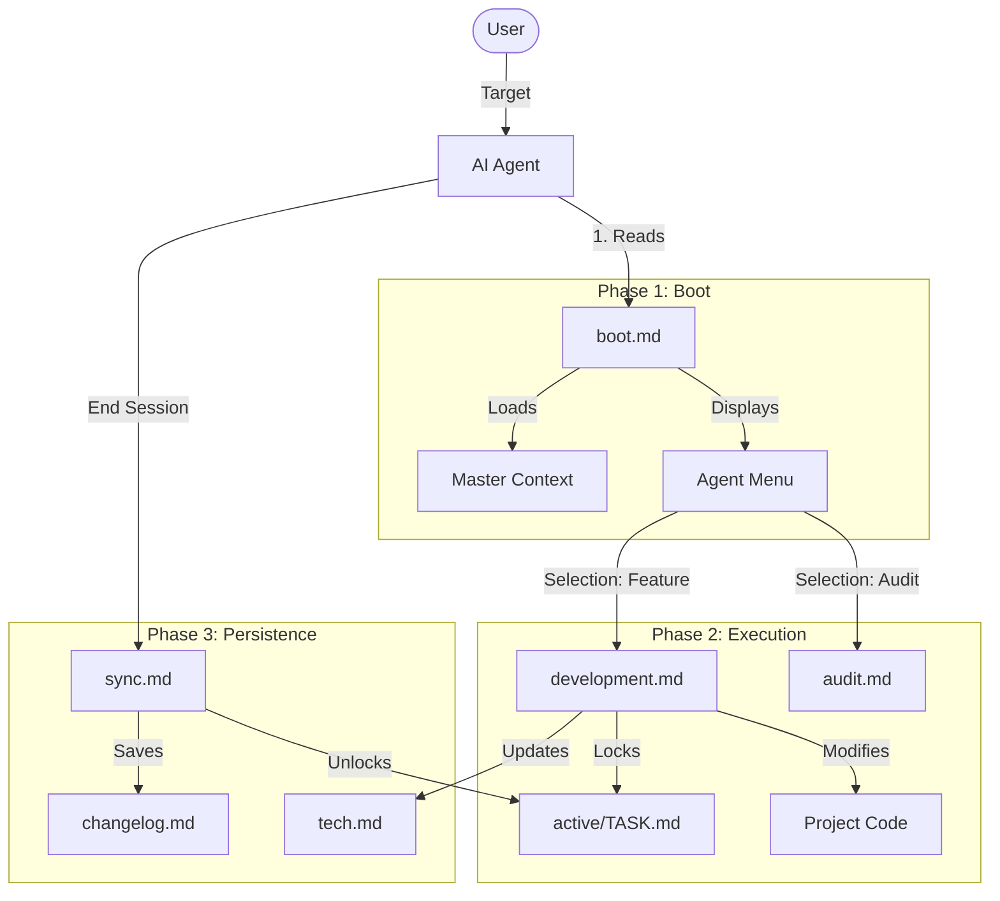

# UCP Architecture Analysis & Review

> **Generated for**: User Request
> **Version Analyzed**: v2.2.0

## 1. System Map (Data Flow)

This diagram visualizes how an Agent moves through the UCP ecosystem.

## 2. Component Analysis

| Component | Type | Role | Status |
|-----------|------|------|--------|
| **boot.md** | **Kernel** | The "BIOS" of the system. Loads context and sets rules. | 🟢 **Robust** (Recent v2.2 fixes) |
| **development.md** | **Logic** | The "CPU". Unified logic for changing code. | 🟢 **Efficient** (Consolidated) |
| **audit.md** | **Sensor** | The "Eyes". Scans reality to update context. | 🟡 **Critical** (Must be run often) |
| **MASTER.md** | **Memory** | The "RAM". High-level state. | 🟢 **Stable** |
| **tech.md** | **Cache** | The "L2 Cache". Technical details. | 🔴 **Risk** (Prone to drift) |
| **universal.md** | **Bridge** | The "Driver". Connects AI tools to UCP. | 🟢 **Clean** |

## 3. Review Findings

### ✅ Strengths
1.  **Tool Agnostic**: The `universal.md` bridge is a killer feature. It decoupling the project memory from the specific AI tool (Cursor/Windsurf) is excellent.
2.  **Self-Healing**: The new "Context Drift Policy" in `boot.md` is a major architectural win. It authorizes agents to fix the map when they see the territory has changed.
3.  **Governance**: The `active/` lock system prevents multiple agents (or multiple sessions) from clobbering each other's work.

### ⚠️ Weaknesses & Risks
1.  **The "Lying Cache" Problem**:
    *   `tech.md` and `map.md` are static files mocking dynamic state.
    *   *Risk*: If a user manually changes code without updating these files, the Agent will hallucinate based on old maps.
    *   *Mitigation*: The `audit.md` workflow is the only fix. It needs to be run more often.

2.  **Human Discipline**:
    *   The system relies on the Human (or Agent) actually running `sync` at the end. If the window is closed abruptly, `context/active/PLAN.md` might become stale.

## 4. Recommendations

1.  **Automated Audit Hooks**:
    *   If using `corepackai` CLI, add a pre-commit hook that runs a lightweight version of `audit.md` to update file trees in context.

2.  **"Dirty Bit" Flag**:
    *   Add a `last_audit` timestamp to `tech.md`. If `Current Date - last_audit > 7 days`, `boot.md` should warn the agent: "Context is stale. Run Audit."

3.  **Visualization**:
    *   `map.md` is text-based. In the future, we could have agents generate a `map.mermaid` file which renders a visual architecture graph for the user.

## Conclusion
The UCP v2.2 architecture is **production-ready** for personal and team use. It successfully bridges the gap between "Stateless LLMs" and "Stateful Projects". The consolidation of workflows has significantly reduced the cognitive load for agents.
